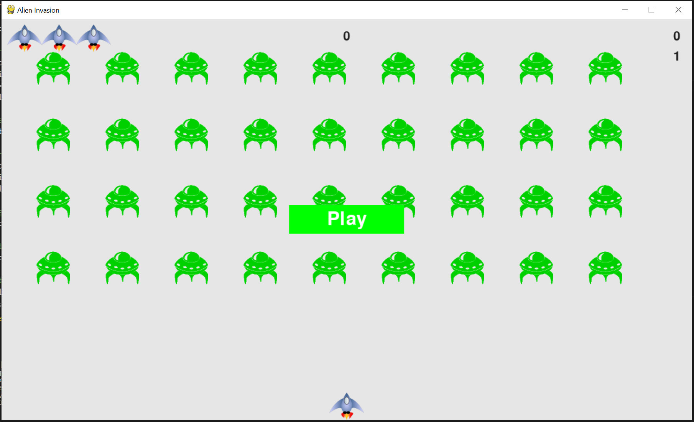

# Alien Invasion

Video Demo: <URL [HERE.](https://youtu.be/QGz4MlLBK6s "Alien Invasion")>

## Description

Alien invasion is a clone of the popular arcade game of the same name. I created this game by follwing the "Python Crash Course" book.
I choose to create this game as a way to improve my skills with object oriented programming, python, and code documentation

## Introduction

> In Alien Invasion, the player controls a ship that appears at
> the bottom center of the screen. The player can move the ship
> right and left using the arrow keys and shoot bullets using the
> spacebar. When the game begins, a fleet of aliens fills the sky
> and moves across and down the screen. The player shoots and
> destroys the aliens. If the player shoots all the aliens, a new fleet
> appears that moves faster than the previous fleet. If any alien hits
> the player’s ship or reaches the bottom of the screen, the player
> loses a ship. If the player loses three ships, the game ends.



## Requirements to run

- [Python3](https://www.python.org/)
- [Pygame](https://www.pygame.org/)

## Game Controls

- Space-bar

  - Shoot

- Arrows keys (left - right)
  - Move the ship left / right

## How to play

### Cloning the Repository

```
$ git clone https://github.com/Waters1993/Alien_Invasion.git

$ cd Alien_Invasion
```

### Running

```
$ python alien_invasion.py
```

---

# File descriptions

## alien_invasion

The `alien_invasion.py` file contains the overall class to manage the game assets and the game behaviour. The first function in this class initializes the game and creates the game resources. This includes the game screen, ship, aliens, and bullets. It also includes the creation of the score board, starting scores, and the play button.

The next funtion `def run_game(self)` starts the main loop of the game. This function will continually check for events from the game. While the game is active it will continually update the position of the ship, bullets, and aliens. Once these have been updated the screen will be update to display those new positions.

The functions to check for input from the user such as hitting the space bar or the left and right keys are also defined in this class and contain the code for the game to react to each of these events.

Other events like game collisions such as a bullet hitting an alien or an alien hitting the ship are also created in this class.

The other main functions created in the overall AlienInvasion class are the `def _fire_bullet`, `def _create_alien`, `def _create_fleet`, and the `def _update_screen` functions. These functions do the work to create the aliens, fire bullets, and keep the screen continually updating.

## ship

This file creates a new ship module that will contain the class ship. This class will manage most of the behaviour of the player's ship. The image chosen for the ship is called in this file and then the ship is drawn to the screen.

## bullet

This file creatres a new bullet module that will contain the class bullet. The Bullet class inherits from Sprite, which I imported from the `pygame` module. I used sprites so I can group related elements in my game and act on all the gouped elements at once.

## alien

The alien module containing the alien class. This class is almost identical to the ship class. The main differnece with this class is the placement on the screen.

## settings

Everytime a new functionality is added to the game such as moving the ship, shooting bullets, or having the aliens move across and down the sceen we also create some new settings associated with that functionality. Instead of embedded those settings within the code for each game asset I decided to create a settings module called `settings.py` that has a settings class which contains all the settings values for the game in one place. This approach mean I only needed to work with one settings object any time I needed to access an individual setting of the game.

## button

The button file creates the play button and draws it to the screen. It determines the text displayed, size, color, and location of the button.

## game_stats and scoreboard

Both of these modules contain classes to manage the scores shown on the game. `game_stats.py` keeps track of the current score, level, lives left, and high score. `scoreboard.py` does the work of actually drawing the scores and lives to the screen.
